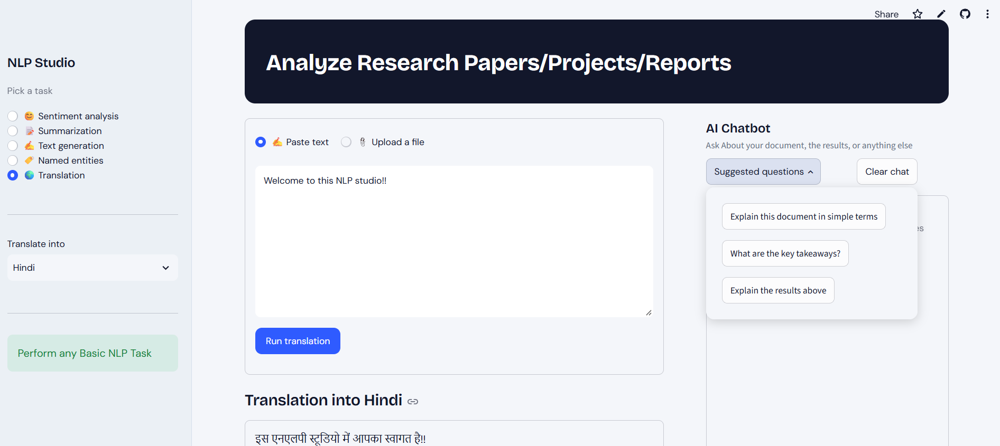
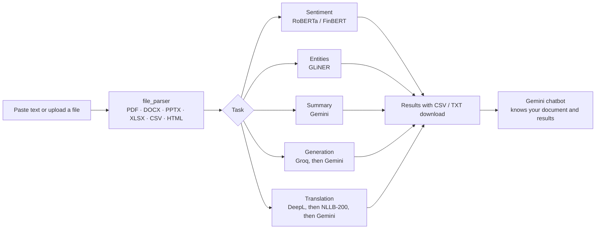

<div align="center">

# 🧠 NLP Studio

**Analyze research papers, reports and documents in one place: sentiment, entities, summaries, text generation, translation, and an AI chatbot that has read your document.**

[](https://www.python.org/)
[](https://streamlit.io/)
[](https://pytorch.org/)
[](https://huggingface.co/docs/transformers)
[](https://github.com/urchade/GLiNER)
[](https://aistudio.google.com/)
[](https://console.groq.com/)
[](https://www.deepl.com/pro-api)
[](https://pandas.pydata.org/)

[**🚀 Live demo**]([https://your-app-name.streamlit.app](https://nlpstudio-tmtpreslvuayu5csevvtm6.streamlit.app/)) · [Features](#-features) · [Quick start](#-quick-start) · [Architecture](#-how-it-works) · [Configuration](#-configuration)

</div>

---

<!-- Add a screenshot or GIF: save it as docs/screenshot.png and uncomment the line below -->
--  --

## ✨ Features

Paste text or upload a file, pick a task in the sidebar, and get results in seconds. A chatbot on the right can answer questions about your document and about the results.

| Task | Engine | API key needed? |
|---|---|---|
| 😊 **Sentiment analysis** | RoBERTa (general, social, reviews) or FinBERT (financial), running locally | None |
| 🏷️ **Named entities** | GLiNER multilingual, with entity types you define yourself, running locally | None |
| 📝 **Summarization** | Google Gemini (reads a whole long document in one request) | Gemini |
| ✍️ **Text generation** | Groq (Llama 3.3 70B), with Gemini as a fallback | Groq or Gemini |
| 🌍 **Translation** (25 languages) | DeepL API Free → local NLLB-200 → Gemini | Optional (NLLB works offline) |
| 💬 **AI chatbot** | Google Gemini, aware of your document and the latest result | Gemini |

<details>
<summary><b>What each task gives you</b></summary>

- **Sentiment:** overall verdict with confidence, positive/neutral/negative meters, a sentiment-through-the-document trend chart, the most positive and most negative passages, passage-by-passage scores, and a CSV download.
- **Entities:** colour-highlighted text, a legend, a table of entities with mention counts and best confidence, a chart by type, an adjustable confidence threshold, and a CSV download. Try types like `person, organization, location, date, money, product`, or anything else you need.
- **Summarization:** choose the length (very short to detailed), the format (paragraph, bullets, executive brief, key facts and figures), and an optional focus such as "payment terms".
- **Generation:** write emails, rewrites and drafts using your document as reference. Set the tone, length and creativity.
- **Translation:** keeps paragraph breaks and shows live progress. If DeepL is unavailable or doesn't offer a language, the app falls back automatically.
- **Chatbot:** ask for plain-language explanations, key takeaways, or why a result came out the way it did.

</details>

## 📂 Supported files

PDF · Word (`.docx`) · PowerPoint (`.pptx`) · Excel (`.xlsx`) · CSV · TXT · Markdown · JSON · HTML

Text is extracted in reading order (Word tables and PowerPoint speaker notes included).

## 🧩 How it works



**Built to keep working on free tiers.** Every provider has a fallback chain, and errors are turned into messages a user can act on:

- **Gemini:** the app asks your key which models it can use and prefers the ones with the biggest free quota. If a model is rate-limited or retired, it moves to the next.
- **Groq:** tries `llama-3.3-70b-versatile`, then `openai/gpt-oss-120b`, then `llama-3.1-8b-instant`. If Groq is unavailable, Gemini writes the text instead.
- **Translation:** DeepL API Free first, then Meta's NLLB-200 running locally (no key or quota), then Gemini as a last resort.

## 🛠️ Tech stack

| Area | Technologies |
|---|---|
| App framework | [Streamlit](https://streamlit.io/) |
| Local NLP models | [Hugging Face Transformers](https://huggingface.co/docs/transformers), [PyTorch](https://pytorch.org/), [GLiNER](https://github.com/urchade/GLiNER), SentencePiece |
| Hosted models | [Google Gemini](https://ai.google.dev/) (`google-genai`), [Groq](https://groq.com/) (Llama 3.3 70B), [DeepL API](https://www.deepl.com/pro-api) |
| Language detection | `langdetect` |
| File parsing | `pypdf`, `python-docx`, `python-pptx`, `openpyxl`, `pandas`, `beautifulsoup4` |
| Config and HTTP | `python-dotenv`, `requests` |

**Models used**

| Purpose | Model |
|---|---|
| General sentiment | [`cardiffnlp/twitter-roberta-base-sentiment-latest`](https://huggingface.co/cardiffnlp/twitter-roberta-base-sentiment-latest) |
| Financial sentiment | [`ProsusAI/finbert`](https://huggingface.co/ProsusAI/finbert) |
| Named entities | [`urchade/gliner_multi-v2.1`](https://huggingface.co/urchade/gliner_multi-v2.1) |
| Local translation | [`facebook/nllb-200-distilled-600M`](https://huggingface.co/facebook/nllb-200-distilled-600M) |

## 🚀 Quick start

**Prerequisites:** Python 3.10 or newer, and free API keys for the services you want (see [Configuration](#-configuration)). Sentiment, entities and local translation work with no keys at all.

```bash
# 1. Clone
git clone https://github.com/basant1896/nlp_studio.git
cd nlp_studio

# 2. Create a virtual environment
python -m venv .venv
# Windows:      .venv\Scripts\activate
# macOS/Linux:  source .venv/bin/activate

# 3. Install dependencies
pip install -r requirements.txt

# 4. Add your keys (see the next section), then run
python -m streamlit run app.py
```

Then open <http://localhost:8501>.

> ⏳ **First run:** the local models (RoBERTa, FinBERT, GLiNER, NLLB) download once from Hugging Face the first time each one is used, so the first run of a task is slower. After that they load from your local cache.

## ⚙️ Configuration

Create a `.env` file in the project root. **Never commit it.** Make sure `.env` is listed in your `.gitignore`.

```env
# Summarization and the chatbot (free key: https://aistudio.google.com/apikey)
GEMINI_API_KEY=your_gemini_key

# Text generation, falls back to Gemini if missing (free key: https://console.groq.com/keys)
GROQ_API_KEY=your_groq_key

# Translation, falls back to local NLLB-200 if missing (free key: https://www.deepl.com/pro-api)
# Free-plan keys end with ":fx"
DEEPL_API_KEY=your_deepl_key:fx

# Optional: avoids Hugging Face download rate limits
HF_TOKEN=your_hf_token
```

You can also paste the keys into the app's sidebar instead of using a `.env` file.

<details>
<summary><b>Optional overrides</b> (leave unset to use the built-in defaults)</summary>

| Variable | Purpose | Default |
|---|---|---|
| `GEMINI_MODEL` | Force a specific Gemini model to be tried first | auto-discovered |
| `GROQ_MODEL` | Force a specific Groq model to be tried first | `llama-3.3-70b-versatile` |
| `NLLB_MODEL` | Local translation model | `facebook/nllb-200-distilled-600M` |
| `SENTIMENT_QUANTIZE` | `0` disables int8 quantization of the sentiment models | `1` |
| `GLINER_BF16_EMBED` | `0` disables bfloat16 storage of GLiNER's embedding table | `1` |
| `MAX_RESIDENT_MODELS` | How many heavy local models may stay in RAM at once | `1` |
| `HF_HUB_DISABLE_SYMLINKS_WARNING` | `1` silences the Windows symlink warning | unset |

</details>

## 📏 Limits

| What | Limit |
|---|---|
| Document length | 400,000 characters (longer documents are clipped, and the app tells you) |
| Sentiment | up to 250 passages |
| Entities | up to 150 passages analysed, first 40 highlighted |
| Generation reference text (Groq) | 16,000 characters |
| Local translation (NLLB) | 60,000 characters |

## 🧠 Memory-aware by design

The app is deployable on small hosts such as Streamlit Community Cloud, which has roughly 2.7 GB of RAM. Three things make that possible:

- **One heavy model at a time.** `model_store.py` keeps at most one of RoBERTa/FinBERT, GLiNER or NLLB in memory and evicts the previous one before loading the next. Switching tasks may briefly reload a model from the local cache.
- **A lean GLiNER loader.** The stock loader briefly holds two full copies of the weights. NLP Studio streams the weights in and stores the huge embedding table in bfloat16, so the loading peak stays far lower.
- **Smaller local models.** Sentiment models use int8 dynamic quantization, and the NLLB fallback is loaded in bfloat16.

## 🗂️ Project structure

```
nlp_studio/
├── app.py              # Streamlit UI: sidebar, results, chatbot
├── nlp_engine.py       # The five NLP tasks and their fallback logic
├── providers.py        # Groq, DeepL and local NLLB-200 clients
├── gemini_client.py    # Gemini wrapper: model discovery, retries, streaming
├── model_store.py      # Keeps RAM in check by holding one heavy model at a time
├── file_parser.py      # PDF/DOCX/PPTX/XLSX/CSV/HTML → clean text
├── assets/
│   └── style.css       # Custom styling
├── requirements.txt
└── .env                # Your keys (not committed)
```

## ☁️ Deploy on Streamlit Community Cloud

1. Push the repository to GitHub (without `.env`).
2. On [share.streamlit.io](https://share.streamlit.io), create a new app pointing to `app.py`.
3. Under **Advanced settings → Secrets**, add your keys:

   ```toml
   GEMINI_API_KEY = "your_gemini_key"
   GROQ_API_KEY = "your_groq_key"
   DEEPL_API_KEY = "your_deepl_key:fx"
   HF_TOKEN = "your_hf_token"
   ```

4. Deploy. If you push code changes and the app behaves oddly or runs low on memory, use **Manage app → Reboot** to start from a clean process.

## ⚠️ Known limitations

- **Scanned PDFs** (images of text) aren't read. The app warns you and asks for a searchable PDF or pasted text.
- **Old Office formats** (`.doc`, `.ppt`, `.xls`) aren't supported. Save them as `.docx`, `.pptx` or `.xlsx` first.
- **Free-tier quotas** apply to Gemini, Groq and DeepL. When one runs out, the app falls back where it can and explains what happened.
- **NLLB-200 is licensed CC-BY-NC**, which means non-commercial use only. This affects only the local translation fallback.

## 💡 Ideas for the future

- [ ] OCR support for scanned PDFs
- [ ] Export results as PDF or Word reports
- [ ] Compare two documents side by side
- [ ] More translation languages and entity presets

## 🙏 Acknowledgements

[Hugging Face](https://huggingface.co/) · [Cardiff NLP](https://huggingface.co/cardiffnlp) · [Prosus AI (FinBERT)](https://huggingface.co/ProsusAI/finbert) · [GLiNER](https://github.com/urchade/GLiNER) · [Meta AI (NLLB-200)](https://ai.meta.com/research/no-language-left-behind/) · [Google Gemini](https://ai.google.dev/) · [Groq](https://groq.com/) · [DeepL](https://www.deepl.com/) · [Streamlit](https://streamlit.io/)

## 📄 License

Add your license here (for example MIT) and place a `LICENSE` file in the repository root.

## 👤 Author

**Basant** · [GitHub](https://github.com/basant1896)

If this project helped you, consider giving it a ⭐
